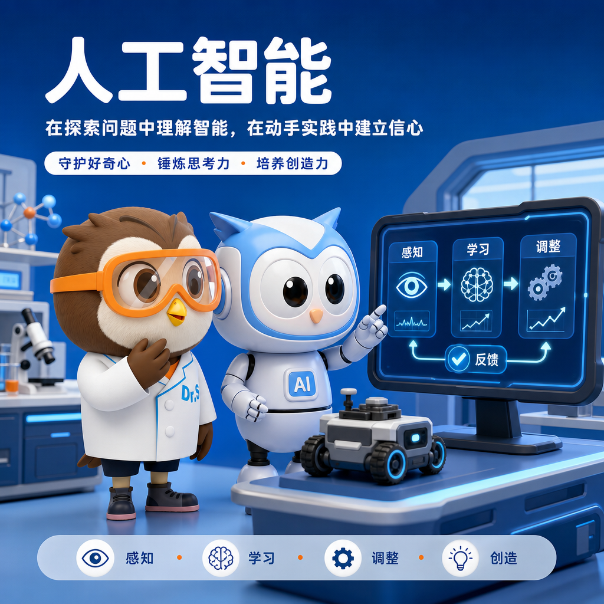

<p align="center">
  <picture>
    <source
      srcset="./docs/portfolio/assets/edu-ai-lead-agent-logo.png"
      media="(prefers-color-scheme: dark)"
    >
    <source
      srcset="./docs/portfolio/assets/edu-ai-lead-agent-logo.png"
      media="(prefers-color-scheme: light)"
    >
    
  </picture>
</p>

<p align="center">
  <strong>An evidence-grounded multi-agent content system for science education.</strong>
</p>

面向科学教育与 AI 教育内容运营的多 Agent 系统：从权威来源采集、事实治理和选题排序，到品牌文案、配图、审核、素材包与内部交付，形成可追溯、可评测、可恢复的完整内容生产链。

本地共享的赛先生/小赛 IP 图片上传、分类、检索、收藏、下载排行与可选生图 MVP，共享图库入口为 `/ip-assets`，独立创作室为 `/ip-assets/create`，参见 [IP 数字资产中心运行手册](docs/ip-digital-asset-hub-local.md)。生成结果默认进入浏览器本地个人素材架，明确分享后才进入共享图库。该功能默认关闭且没有鉴权，只允许本机或可信公司内网使用，不挂载到根路径的共享开发控制台。

[项目亮点](#项目亮点) · [真实内容产出](#真实内容产出) · [系统流程](#系统流程) · [快速开始](#快速开始) · [个人简历](#个人简历) · [文档导航](#文档导航)

## 项目亮点

- **证据驱动**：保存来源快照、事实标签、事件版本与证据绑定，文案可以回溯到具体来源。
- **混合选题**：确定性阈值与硬否决保证底线，LLM 只在合格候选中做受控重排，失败时稳定回退。
- **品牌 RAG**：用 PostgreSQL/pgvector 检索数字 IP、品牌定位和视觉资产，品牌内容不冒充新闻事实。
- **多模态生产**：生成家长友好文案、品牌配图和素材包，并执行文案、图片、相似度与可选 OCR 检查。
- **Agent 工程化**：LangGraph 有界执行、强类型 Tool Registry、MCP stdio、引用校验、安全 Trace 和离线评测。
- **可靠交付**：幂等任务、checkpoint、重试/回退、备份与内部企业微信交付；不提供公开平台无人审核发布。

## 真实内容产出

以下内容来自历史上已通过校验的本地素材包，并非为 README 重新调用模型生成。

<p>
  <a href="./docs/portfolio/content-showcase.md#science-learning-by-doing">
    
  </a>
  <a href="./docs/portfolio/content-showcase.md#brain-computer-interface-ai">
    
  </a>
</p>

<details>
<summary><strong>科学教育“做中学” · 展开完整文案</strong></summary>

> 看到一条教育新闻想跟大家聊聊。7月29日，全国义务教育阶段科学教育"做中学"领航行动部署会在京召开，会议提到要针对"重知识传授、轻能力培育"的问题，引导学生从兴趣出发，提出问题、探究验证、反思交流，全面提升学生科学素养。
>
> 说白了，就是别让孩子光背公式，得自己动手去试、去想。科学为什么值得学？因为孩子天生爱问"为什么"，当他自己动手验证一个猜想，那种"原来如此"的感觉，比记住一个答案有用得多。这种提问和动手解决问题的习惯，是跟着孩子一辈子的能力。
>
> 在赛先生，我们做的就是这样的事。课堂上孩子不是坐着听，而是用STEAM玩教具动手做实验，像小工程师一样解决真实问题。我们的AI导师（就是能跟孩子对话、引导思考的智能学习助手）不会直接甩答案，而是反问孩子"你觉得呢"，一步步引导他自己想明白。比如孩子问"为什么天是蓝的"，AI不会直接说术语，而是先问"你觉得光有颜色吗"，让孩子自己发现答案。
>
> 我们希望每个孩子都能像科学家一样思考，像工程师一样解决问题，把好奇心变成改变世界的力量。
>
> \#赛先生科学 \#做中学 \#科学素养

[查看验证信息](./docs/portfolio/content-showcase.md#science-learning-by-doing)

</details>

<details>
<summary><strong>脑机接口与人工智能 · 展开完整文案</strong></summary>

> 🧠科学家用人工智能（让电脑学会理解人的想法）把脑信号变成文字，不用做手术就能读出人在打什么字。
> 这项技术有望帮助失去说话能力的人重新跟外界沟通，让孩子看到知识真的能改变别人的生活🤝
>
> 💡孩子学科学不只是背公式，更重要的是学会提问和动手解决问题，理解世界运转的道理。
> 当孩子开始问"为什么雨滴是圆的"，那种好奇心比任何标准答案都珍贵✨
>
> 🔬在赛先生，老师不直接给答案，而是用启发式提问引导孩子自己拆解问题、动手做实验。
> 从科学启蒙到科创竞赛，孩子能把想法变成真正的作品，在探索中长出受用一生的能力🌱
> \#赛先生科学 \#脑机接口 \#好奇心

[查看验证信息](./docs/portfolio/content-showcase.md#brain-computer-interface-ai)

</details>

## 系统流程

```text
权威来源
   ↓
候选与不可变快照
   ↓
事实治理 · 去重 · 事件组织
   ↓
规则过滤 · 评分阈值 · LLM 受控重排
   ↓
证据 + 品牌 RAG → 文案 → 配图 → 质量检查
   ↓
素材包 · 人工审核 · 内部交付
```

公众号长文使用独立的本地模拟链路，不改变朋友圈短文或企业微信交付：

```text
合格素材包 / 脱敏 fixture
   ↓
结构化 Article Package → 确定性审校与模型审校
   ↓
固定微信兼容 HTML → 本地正文图 / 封面 → 本地模拟草稿
```

模型不生成 HTML、CSS、链接或媒体地址；浏览器只通过带 CSP 的无权限 sandbox iframe
查看服务端预览。该链路没有公众号账号、凭据或远端调用能力。

生产业务和求职 Workbench 共用强类型领域能力，但 Workbench 不注册到生产 API、Dockerfile 或 Compose，也不能写业务数据或触发交付。

## 快速开始

### 环境

- Conda
- Docker 29+ / Docker Compose 2.40+
- Node.js 20.19+ / npm
- Make、Bash、curl

### 初始化

```bash
conda env create -f environment.yml
conda activate edu-ai
make env-init setup infra-up migrate seed-sources doctor
```

### 启动本地业务栈

```bash
make stack-up
```

默认地址：API `127.0.0.1:8000`、PostgreSQL `127.0.0.1:5432`、MinIO `127.0.0.1:9000`、Vite `127.0.0.1:5173`。

### 运行 Agent Workbench

```bash
make agent-portfolio-check

# 终端 1
make agent-workbench-dev

# 终端 2
make agent-workbench-ui
```

Workbench 只绑定 `127.0.0.1:8010`，前端仅在 Vite development 且显式启用本地 flag 时出现。

### 运行公众号本地草稿演示

先完成 `make setup`，确保 `frontend/node_modules` 已安装。下面一条命令会按需构建并启动
PostgreSQL、MinIO、迁移、业务 API、独立本地草稿 worker 和 Vite，然后幂等创建一条完全离线的
脱敏 fixture。所有端口只绑定 loopback；该命令会强制 `AI_PROVIDER_MODE=disabled`，即使本地 `.env`
另有模型配置，也不会为演示构造模型客户端或发起外部请求：

```bash
make official-account-local-demo
```

浏览器打开 `http://127.0.0.1:5173`，进入“公众号本地草稿台”。按 `Ctrl-C` 停止本次 Compose
前台进程；持久化数据库用于重复打开同一模拟草稿。界面和 API 始终标注“本地模拟，未同步公众号”。

#### 微信公众号编辑器本地交接

开发工作台可在运行 `ready` 且最终人工审稿不可变批准后，生成一条独立的小赛蓝编辑器交接投影。
`make official-account-local-demo` 会显式打开该开发能力；手工启动时必须同时满足：

```dotenv
APP_ENV=development
OFFICIAL_ACCOUNT_LOCAL_ENABLED=true
OFFICIAL_ACCOUNT_EDITOR_HANDOFF_ENABLED=true
VITE_OFFICIAL_ACCOUNT_LOCAL_ENABLED=true
```

后端和前端任一 flag 关闭，或 `APP_ENV` 不是 `development`，交接区与交接资源都会 fail closed。
工作台提供微信兼容纯正文复制、sandbox 预览、正文图/新闻上下文图/2.35:1 封面独立下载和确定性 ZIP。
ZIP 包含 `article-body.html`、`preview.html`、Markdown/JSON 安全投影、来源/权利/审稿/预检/移动端状态、
主题、manifest 和相对 `assets/`；同一批准输入重复读取保持正文和 ZIP 字节一致。

这仍是本地手工交接，不是微信草稿：正式进入微信公众号编辑器后需要重新上传正文图，并单独设置封面。
系统不读取 AppID、AppSecret 或 token，也不上传、发布或群发。带
`publish_permission_unverified` 的新闻原图会按当前交接策略直接保留，同时在正文、rights manifest、
预检和 UI 中持续显示“发布权未验证”；该提示不代表图片已经授权，也不放宽历史 `copy-ready` 导出规则。

新创建的运行默认使用 `wechat-html-renderer-v7-multimodal-media` 科学田野手册版式：首屏先说明家长阅读价值，并从
文章已有章节标题确定性生成 3--5 项“家长先看”阅读地图；正文用 `PART 01` 信息轨、关键判断和
家庭实践卡组织层次，结语只拆分已有文本为最多三张行动卡。较长段落只在中文句末做确定性拆分。
其视觉为本项目原创设计，仅吸收本地保存案例的结构规律，不复制其原文、素材、吉祥物、二维码或
促销表达。`official-account-media-plan-v3-multimodal-hybrid` 仅允许清单中现有的 41 张已批准、checksum
匹配且适合正文发布的品牌图片参加 live 正文排序，不会扫描任意文件；素材包已验证主图始终作为独立封面。
默认 `OFFICIAL_ACCOUNT_LOCAL_VISUAL_SEMANTIC_ENABLED=false`，按章节标题与最多 360 个规范化正文字符执行
确定性标签回退。只有显式 live opt-in、Qwen3-VL 身份和 41 项索引覆盖预检全部成立时，才对每个正文位置
进行一次多模态 embedding 查询；任何 provider、结果或 catalog race 失败都会丢弃整张相似度矩阵，再统一
回退，绝不混用部分分数。相似度只调整合格候选顺序，不改变图片数量、章节位置或人工审稿要求。

若需要为 live 文章的每个正文位置生成原创插画，另行显式设置
`OFFICIAL_ACCOUNT_LOCAL_GENERATED_VISUALS_ENABLED=true`，并同时配置 `IMAGE_ENABLED=true`、一个
真实图片 provider 与 `IMAGE_MAX_ATTEMPTS=1`。系统先完成同一套 41 项完整索引预检与 Qwen3-VL
章节匹配（不可用时使用已持久化的确定性选择快照），随后才把每个已选公开参考项作为私有图像输入生成。
当前 v2 会在对应章节内确定性锚定一个语义正文块，仅持久化块位置、类型和指纹，并用该块内容、标题与
文章主题临时构造场景指令。有效 PNG 参考在 provider 请求中保持原字节；catalog JPEG 会按版本化规则转成
无元数据 PNG 后供 ToApis/Comfly 使用。每张图在调用前写入不可变 intent；调用超时会立即转为
`result_unknown`，恢复时不会暗中再次请求。成功结果会先确定性转为无 EXIF/ICC 的 1536×1024 JPEG，
该实际 3:2 字节进入私有存储，并由画廊、本地 HTML 与导出共同使用。
提示词、向量、原始资产 ID、provider body 和存储路径不会写入数据库、API 或导出包。这里没有图片层面的
人工审核闸门；文章的独立人工审稿、`copy-ready` 边界及“本地模拟，未同步公众号”标签保持不变，且绝不调用
微信或 WeCom。
四节 fixture 的三张图固定落在第 1、3、4 节（零基 0/2/3），且不创建视觉 HTTP 客户端。已保存的
v1--v7 prompt/article/render/media/export 工件继续按原版本身份逐字节重放，混搭或未知版本会关闭失败。
新的 live 运行使用 v8 结构化输出身份：首轮请求在系统指令中携带受限的 JSON Schema，使长文生成与
审校更容易一次返回可验证结构；失败时仍最多只允许一次受控纠正。默认生成上限为 16,384 tokens，
schema、系统指令和用户输入会共同计入输入限额。

当前 fixture 使用 `official-account-local-adapter-v5-multimodal-media`。PNG master 不修改；正文
1536×1024 与封面 1923×818 的 `*-publication-v2.jpg` 由
`scripts/create_official_account_publication_derivatives.py` 确定性生成：Pillow RGB、JPEG quality 82、
4:2:0 subsampling、`optimize=false`、`progressive=false`，且不携带 EXIF/ICC/文本元数据。路径、MIME、
尺寸、字节数与 SHA-256 在代码和测试中固定，导出文件扩展名与 `image/jpeg` 一致。
live catalog 图片也只在 media 边界按公开 16 字符引用重新解析和校验，再生成相同参数的无元数据、受限
JPEG publication derivative；私有文件名、路径、向量、原始分数和查询文本都不会持久化或进入 API。

当 fixture 运行达到 `ready` 后，开发态 workbench 会显示“最终人工审稿”轨道。审稿人需要填写有界
标识，可选填写备注，再明确批准或退回；决定单次、不可改写，同一完整请求可幂等重放。模型审校、素材包
审核与该最终人工决定彼此独立，任何运行都不会自动批准。随后可用运行 ID 导出完全本地的人工复核包：

```bash
make official-account-local-export RUN_ID=<uuid>

# 可选：指定其他本地目录
make official-account-local-export RUN_ID=<uuid> OUTPUT_DIR=output/official-account-local

# 只有已经人工批准的当前版本运行才能生成独立的可复制包
make official-account-local-export RUN_ID=<uuid> MODE=copy-ready
```

导出目录包含 README、文章 JSON/Markdown、带相对图片的正文 HTML、离线预览 HTML、按 ordinal 命名为
`body-00.jpg` 至 `body-04.jpg` 的当前正文图（历史 bundle 保持原 `.png` 树）、横版
封面、来源/审稿/预检 JSON、文件哈希 manifest 和 ZIP。写入先在同级临时目录完成，再原子改名；同一
工件可幂等重放，已有目录内容不一致时拒绝覆盖。`wechat-draft-preflight-v1` 中的标题、作者、摘要和
HTML 上限是未经真实账号校准的保守规则，不会伪装成微信官方已验证限制。pending/rejected 的 review
bundle 保留 `NOT READY FOR PUBLICATION` 警示；只有 approved 记录能生成另一条不可变 `copy-ready`
路径，正文才省略警示栏，manifest 会记录 approval identity 与 `copy_ready=true`。批准不会修改或复用
此前 pending bundle。移动端截图若未运行会明确记录为 `not_run`，不会生成伪造截图。导出过程只读取
本地 PostgreSQL 与 fixture 文件，不访问模型或微信。

真实素材包运行默认仍会被上述导出命令拒绝。若需要把一个已经 `ready` 的真实运行保存到本机供人工
审阅，必须在 CLI 中显式确认；该命令只读取已持久化的 HTML 和媒体字节，不启动 worker、不会调用模型，
也不会连接微信公众号或企业微信：

```bash
cd backend
OFFICIAL_ACCOUNT_LOCAL_ENABLED=true \
  conda run --name edu-ai python -m app.official_account_local_cli export \
  --run-id <ready-live-run-uuid> \
  --allow-live-local-export \
  --output-dir ../output/official-account-live-local
```

该包固定标注 `LOCAL ONLY · 未同步公众号`：它包含相对本地图片的已解析 HTML、离线预览、Markdown、
JSON、来源/审稿/预检/清单文件和确定性 ZIP，但始终 `copy_ready=false`、`published=false`。人工审稿是
pending、approved 或 rejected 都会如实保留；即使已经 approved，这个显式 live-local 包也不是发布包。

真实长文只在 `.env` 已有服务器端 `AI_PROVIDER_MODE=zhipu`、HTTPS `AI_PLATFORM_BASE_URL`、
`AI_PLATFORM_API_KEY` 和模型配置时可用。下面的命令会用这些服务器端配置启动或重建 opt-in worker，
再显式提交一个已通过文案/图片校验和审校、且未被拒绝的素材包：

```bash
make official-account-local-live-smoke MATERIAL_PACKAGE_ID=<uuid>
```

命令只输出运行 ID、provider/model、usage、状态和 loopback 浏览器地址。它不会输出 prompt、模型原始
响应、品牌正文、对象路径或密钥，也不会连接微信公众号。相同输入与版本指纹会复用原运行。

### 常用质量门

```bash
make backend-check        # Ruff + mypy + pytest
make frontend-check       # Prettier + ESLint + TypeScript + Vitest + build
make agent-portfolio-check
make api-contract-check
make doctor
make check
```

## 个人简历

[下载公开版 PDF](./docs/portfolio/resume/resume-public.pdf) ·
[查看 LaTeX 源文件](./docs/portfolio/resume/resume-public.tex)

## 文档导航

| 主题                                 | 文档                                                                           |
| ------------------------------------ | ------------------------------------------------------------------------------ |
| Agent Workbench 架构、工具与面试讲解 | [Agent Workbench case study](./docs/portfolio/agent-workbench.md)              |
| 两组真实文案与对应配图               | [真实内容产出](./docs/portfolio/content-showcase.md)                           |
| Agent / LLM 应用开发实习简历         | [个人简历](./docs/portfolio/resume/README.md)                                  |
| Agent 确定性评测                     | [Eval README](./backend/evals/agent_workbench/README.md)                       |
| 生产发布、回退与 Digest 契约         | [固定 Digest 发布运行手册](./docs/operations/digest-release-runbook.md)        |
| 服务器迁移与视觉能力启用             | [生产服务器迁移手册](./docs/operations/production-server-migration-runbook.md) |
| 后端工程规范                         | [Backend specs](./.trellis/spec/backend/index.md)                              |
| 前端工程规范                         | [Frontend specs](./.trellis/spec/frontend/index.md)                            |
| 项目技术报告                         | [技术报告.pdf](./技术报告.pdf)                                                 |

## 安全边界

- 来源访问必须通过 HTTPS 白名单、公共 DNS/IP、重定向、大小和内容类型检查。
- Agent 与日志不暴露密钥、完整 prompt、原始模型响应、私有对象路径或内部品牌全文。
- Workbench 默认离线、只读且仅绑定 loopback；生产系统不暴露任意 URL、shell 或自动公开发布工具。
- `.env`、API Key、数据库密码、签名 URL 和社媒凭据不得进入仓库。

GitHub 仓库是 Codeup 权威源的单向作品集备份，不反向覆盖 Codeup，也不触发生产部署。
