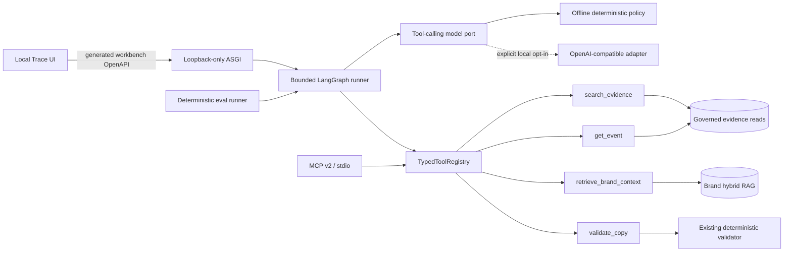

# Agent Research Workbench

> A local-only portfolio slice that turns the repository's governed evidence, brand RAG,
> LangGraph orchestration, and deterministic copy checks into a measurable Agent engineering demo.

## Why this exists

The production system already has strong task-specific automation, but that is different from a
general Agent application boundary. The workbench makes the missing engineering pieces explicit:

- one typed, read-only tool catalog shared by Function Calling, MCP, and evaluation;
- a bounded decision loop with hard step, call, timeout, and output budgets;
- claim-level citations checked against observations from the current run;
- a redacted execution trace that explains actions without exposing hidden reasoning;
- a deterministic, no-key evaluation track whose results can be reproduced locally.

The workbench is deliberately not deployed with the business application. It has an independent
loopback-only ASGI entry point, a separate OpenAPI document, a development-only UI, and an stdio-only
MCP adapter.

## Architecture



The registry owns each tool's name, description, Pydantic input/output model, timeout, and response
size. Agent, MCP, and eval code wrap that same catalog instead of defining parallel schemas.

## Safety model

| Boundary        | Enforced behavior                                                                            |
| --------------- | -------------------------------------------------------------------------------------------- |
| Tool surface    | Four allowlisted read-only tools; no URL fetch, shell, file, SQL, delivery, or retry tool    |
| Agent budget    | At most four model turns and four proposed/executed tool calls                               |
| Grounding       | External factual claims cite evidence returned successfully in the same run                  |
| Brand isolation | Brand chunks are always `evidence_eligible=false` and cannot prove public facts              |
| Trace privacy   | No hidden chain-of-thought, raw prompts, provider bodies, secrets, or private object paths   |
| HTTP            | Independent app, loopback socket-peer check, forwarded-header rejection, disabled by default |
| MCP             | Official SDK over stdio only; no HTTP/SSE service and no production Compose entry            |
| Evaluation      | Sanitized fixtures and deterministic rules; no key, network, or LLM judge authority          |

## What the demo proves

1. A model-neutral orchestration layer can validate tool arguments and outputs at one boundary.
2. The runner remains bounded when a model proposes invalid, unknown, repeated, or excessive calls.
3. Citations are data-flow artifacts, not prose decorations: every accepted citation comes from the
   current trace and every catalog item is used by a claim.
4. MCP interoperability does not require a second implementation of the underlying business tools.
5. Evaluation can separate contract/safety correctness from optional live-model intelligence.

The canonical eval report is generated from the versioned fixture dataset. Its measured values—not
this narrative—are the source of truth for resume metrics.

## Reproducible portfolio evidence

The checked deterministic baseline currently passes **42/42 sanitized cases** across six equal
categories. On this contract-focused track, exact tool-set selection, valid arguments, citation
precision, citation coverage, terminal-state accuracy, and refusal accuracy are all 100%; the
unsupported external-claim rate is 0%. These numbers describe the fixed offline policy and safety
contracts—not live-model intelligence or provider quality.

- [Canonical metrics report](../../backend/evals/agent_workbench/canonical-report.md)
- [Versioned evaluation cases](../../backend/evals/agent_workbench/cases.v1.jsonl)
- [Sanitized trace UI screenshot](./assets/agent-workbench-trace.png)

Regenerate the screenshot from the checked fixture and the real React/CSS surface—without starting a
backend, provider, database, or long-lived web server:

```bash
node docs/portfolio/capture-agent-workbench-screenshot.mjs
```

## Five-minute review path

After local setup, run the portfolio gate and then start the two loopback-only development processes:

```bash
make agent-portfolio-check
# terminal 1
make agent-workbench-dev
# terminal 2
make agent-workbench-ui
```

The default path uses sanitized fixtures and a deterministic policy, so it requires neither a model
API key nor a production database. The report and screenshot above are generated from that same
fixture-only path; volatile latency and token diagnostics stay outside the canonical report.

## Interview walkthrough

- Start with the distinction between an automated workflow and a bounded Agent application.
- Show the registry once, then point to its three consumers: Agent, MCP, and eval.
- Trace one multi-tool run from query to validated arguments, observations, claims, and citations.
- Trigger one unsafe request and show the refusal plus zero side effects.
- Open the deterministic report and explain which metrics are contract-authoritative.
- Close with the deferred platform work: authentication, durable AgentOps traces, HTTP MCP, and live
  model benchmarking.

## Resume-ready bullets

- 设计并实现本地只读 Agent Research Workbench，以同一强类型 registry 统一 4 个业务工具的
  Function Calling、MCP v2 stdio 与离线评测契约，杜绝三套 schema/handler 漂移。
- 基于 LangGraph 构建显式有界执行循环（模型轮次、工具次数、单步与总时限），并实现
  claim-level citation catalog 与脱敏 trace；外部事实只能引用本次成功返回的合格证据。
- 建立 42 条、6 类脱敏 deterministic contract cases；当前基线 42/42 通过，参数合法率与引用
  覆盖率 100%，unsupported external-claim rate 0%。该指标明确不等同于 live LLM accuracy。

## Honest limitations

- The deterministic policy baseline proves reproducibility and evaluator correctness, not live LLM
  accuracy.
- The MVP has no persistent Agent memory or run-history tables.
- MCP is a local stdio integration, not a production network service.
- The workbench cannot publish content or mutate the business pipeline.
