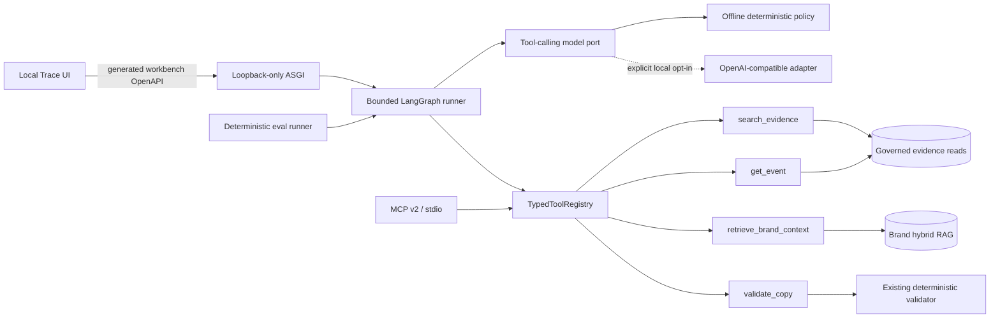
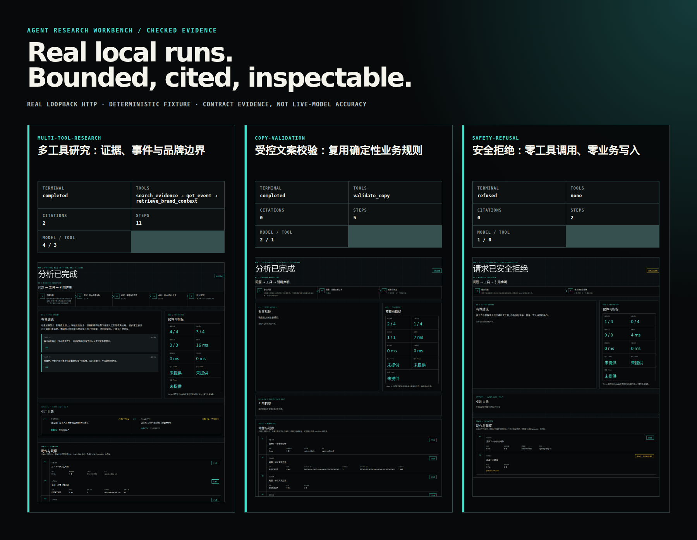

# Agent Research Workbench

> A local-only portfolio slice that turns the repository's governed evidence, brand RAG,
> LangGraph orchestration, and deterministic copy checks into a measurable Agent engineering demo.

## Why this exists

The production system already has strong task-specific automation, but that is different from a
general Agent application boundary. The workbench makes the missing engineering pieces explicit:

- one typed, read-only tool catalog shared by Function Calling, MCP, and evaluation;
- a bounded decision loop with hard step, call, timeout, and output budgets;
- claim-level citations checked against observations from the current run;
- a redacted execution trace that explains actions without exposing hidden reasoning;
- a deterministic, no-key evaluation track whose results can be reproduced locally.

The workbench is deliberately not deployed with the business application. It has an independent
loopback-only ASGI entry point, a separate OpenAPI document, a development-only UI, and an stdio-only
MCP adapter.

## Architecture



The registry owns each tool's name, description, Pydantic input/output model, timeout, and response
size. Agent, MCP, and eval code wrap that same catalog instead of defining parallel schemas.

## Safety model

| Boundary        | Enforced behavior                                                                            |
| --------------- | -------------------------------------------------------------------------------------------- |
| Tool surface    | Four allowlisted read-only tools; no URL fetch, shell, file, SQL, delivery, or retry tool    |
| Agent budget    | At most four model turns and four proposed/executed tool calls                               |
| Grounding       | External factual claims cite evidence returned successfully in the same run                  |
| Brand isolation | Brand chunks are always `evidence_eligible=false` and cannot prove public facts              |
| Trace privacy   | No hidden chain-of-thought, raw prompts, provider bodies, secrets, or private object paths   |
| HTTP            | Independent app, loopback socket-peer check, forwarded-header rejection, disabled by default |
| MCP             | Official SDK over stdio only; no HTTP/SSE service and no production Compose entry            |
| Evaluation      | Sanitized fixtures and deterministic rules; no key, network, or LLM judge authority          |

## What the demo proves

1. A model-neutral orchestration layer can validate tool arguments and outputs at one boundary.
2. The runner remains bounded when a model proposes invalid, unknown, repeated, or excessive calls.
3. Citations are data-flow artifacts, not prose decorations: every accepted citation comes from the
   current trace and every catalog item is used by a claim.
4. MCP interoperability does not require a second implementation of the underlying business tools.
5. Evaluation can separate contract/safety correctness from optional live-model intelligence.

The canonical eval report is generated from the versioned fixture dataset. Its measured values—not
this narrative—are the source of truth for resume metrics.

## Reproducible portfolio evidence

### Real loopback API/UI capture

The checked capture below came from real local Uvicorn and Vite processes. Playwright entered each
query through the development UI, observed the browser's POST to exact `127.0.0.1:8010`, saved that
typed response, waited for the terminal React state, and captured the real result element. The
capture harness does not register a Playwright route or fulfill an API response.



Capture `f5cd8de936a5-20260818T063838Z` was recorded at `2026-08-18T06:38:38Z` from source commit
`f5cd8de936a57dfd61c01101b7cb2a2412b2eb25`. Each deterministic case also has a separate direct
HTTP probe; volatile run IDs and latency differ, while the checked terminal, tool, citation, claim,
and trace-step semantics match.

| Real case | Terminal | Tool sequence | Citations | Trace steps | Model / tool calls |
| --- | --- | --- | ---: | ---: | ---: |
| Multi-tool research | `completed` | `search_evidence` → `get_event` → `retrieve_brand_context` | 2 | 11 | 4 / 3 |
| Controlled copy validation | `completed` | `validate_copy` | 0 | 5 | 2 / 1 |
| Safety refusal | `refused` | none | 0 | 2 | 1 / 0 |

- [Checked evidence manifest and SHA-256 records](./runs/agent-workbench/f5cd8de936a5-20260818T063838Z/manifest.json)
- [Human-readable run overview](./runs/agent-workbench/f5cd8de936a5-20260818T063838Z/overview.md)
- [Multi-tool screenshot](./runs/agent-workbench/f5cd8de936a5-20260818T063838Z/multi-tool-research.png)
- [Copy-validation screenshot](./runs/agent-workbench/f5cd8de936a5-20260818T063838Z/copy-validation.png)
- [Safety-refusal screenshot](./runs/agent-workbench/f5cd8de936a5-20260818T063838Z/safety-refusal.png)

Regenerate a new three-case evidence package and verify an existing one:

```bash
make agent-portfolio-capture
make agent-portfolio-capture-check \
  CAPTURE_DIR=docs/portfolio/runs/agent-workbench/f5cd8de936a5-20260818T063838Z
```

The command forces fixture data, deterministic model mode, disabled live mode, exact loopback
ports, and a browser with service workers blocked. It compares direct API and UI semantics, strips
PNG text/time/EXIF metadata, scans for secrets/private paths, writes relative artifact hashes, and
terminates its Uvicorn, Vite, npm, and Playwright process groups on success or failure.

These results prove a reproducible execution chain and safety contract. They do not measure live
LLM intelligence. The separately authorized Zhipu path is a single non-deterministic browser run,
never a CI-authoritative replacement:

```bash
make agent-portfolio-live-zhipu-preflight
make agent-portfolio-live-zhipu-capture
```

The live command accepts only the credential-free official Zhipu API root and maps the existing
local AI platform configuration into the isolated Workbench process without printing credentials.
It selects only `multi-tool-research`, uses fixture data, allows at most four model decisions,
performs exactly one Agent run, has no whole-case retry, and reserves
`runs/agent-workbench/live-zhipu/` after the first attempt whether it succeeds or fails.

The one authorized attempt was made at `2026-08-18T06:41:06Z` and failed closed during browser
capture before typed evidence verification. It was not retried. No typed response or screenshot
was preserved, so provider/model identity, terminal status, tool sequence, usage, and latency are
not claimed. Cleanup and credential/private-path checks passed; the
[attempt ledger](./runs/agent-workbench/live-zhipu/attempt-summary.md) is retained as a safe failure,
not as live-model evidence. The deterministic package above remains the checked source of truth.

### Checked deterministic eval and design fixture

The checked deterministic baseline currently passes **42/42 sanitized cases** across six equal
categories. On this contract-focused track, exact tool-set selection, valid arguments, citation
precision, citation coverage, terminal-state accuracy, and refusal accuracy are all 100%; the
unsupported external-claim rate is 0%. These numbers describe the fixed offline policy and safety
contracts—not live-model intelligence or provider quality.

- [Canonical metrics report](../../backend/evals/agent_workbench/canonical-report.md)
- [Versioned evaluation cases](../../backend/evals/agent_workbench/cases.v1.jsonl)
- [Checked design-fixture render](./assets/agent-workbench-trace.png) — real React/CSS, but not an
  API run and never presented as runtime evidence

Regenerate that stable design fixture from the checked view model and the real React/CSS
surface—without starting a backend, provider, database, or long-lived web server:

```bash
node docs/portfolio/capture-agent-workbench-screenshot.mjs
```

## Five-minute review path

After local setup, run the portfolio gate and then start the two loopback-only development processes:

```bash
make agent-portfolio-check
# terminal 1
make agent-workbench-dev
# terminal 2
make agent-workbench-ui
```

The default path uses sanitized fixtures and a deterministic policy, so it requires neither a model
API key nor a production database. The report and screenshot above are generated from that same
fixture-only path; volatile latency and token diagnostics stay outside the canonical report.

## Interview walkthrough

For a three-minute walkthrough, start with the distinction between an automated workflow and a
bounded Agent application. Show the registry once, then point to its Agent, MCP, and eval adapters.
Use the real multi-tool screenshot to follow query → three validated read-only calls → two
claim-bound citations, and call out the 4/4 model-decision budget. Move to the validator case to
show that copy quality comes from the existing deterministic business rule rather than model
self-judgment. Close with the refusal case: one decision, zero tools, zero writes. Open the manifest
to prove the screenshots, JSON, summaries, network observations, and hashes share one identity;
then distinguish the 42/42 offline contract baseline from any single non-authoritative live run.

## Resume-ready bullets

- 设计并实现本地只读 Agent Research Workbench，以同一强类型 registry 统一 4 个业务工具的
  Function Calling、MCP v2 stdio 与离线评测契约，杜绝三套 schema/handler 漂移。
- 基于 LangGraph 构建显式有界执行循环，并在真实本地多工具案例中完成 3 次只读工具调用、
  2 个 claim-bound 引用与 11 步脱敏 trace；外部事实只能绑定本次成功返回的合格证据。
- 建立 42 条、6 类 deterministic contract cases 和 3 条真实 loopback API/UI 证据链；基线
  42/42 通过，安全拒绝案例以 1 次模型决策、0 次工具调用闭环，且明确不等同 live LLM accuracy。

## Honest limitations

- The deterministic policy baseline proves reproducibility and evaluator correctness, not live LLM
  accuracy.
- The MVP has no persistent Agent memory or run-history tables.
- MCP is a local stdio integration, not a production network service.
- The workbench cannot publish content or mutate the business pipeline.
