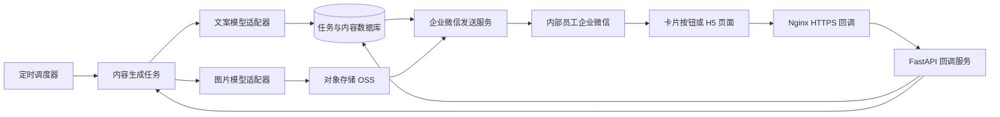

# 朋友圈内容自动生成与企业微信分发技术方案

## 1. 目标与边界

本系统每天自动生成一条朋友圈文案和一张配图，并通过企业微信自建应用发送给指定的内部员工。员工在企业微信中预览、重新生成或确认内容，再自行发布到个人朋友圈。

系统目标：

- 按北京时间每天定时生成文案和配图。
- 自动把文案与图片发送到指定内部员工的企业微信会话。
- 用企业微信卡片提供“重新生成文案”“重新生成配图”“预览”“发送测试”等操作。
- 记录每次生成、发送、重试和员工操作，避免重复发送。
- 支持后续从一个员工扩展到多个运营人员。

明确不做的事：

- 不通过自动化脚本代替员工发布个人朋友圈。企业微信自建应用可以发送内容，但不能合规地静默代发员工个人朋友圈。
- 不把企业微信密钥、模型 API Key、数据库密码写入代码或 Git 仓库。

## 2. 推荐架构



推荐部署在阿里云同一台服务器上。第一版可采用 Docker Compose：

| 服务               | 职责                                 | MVP 是否需要 |
| ------------------ | ------------------------------------ | ------------ |
| `api`（FastAPI） | 企业微信回调、管理接口、健康检查     | 需要         |
| `worker`         | 调用文案模型、图片模型、企业微信 API | 需要         |
| `scheduler`      | 每日创建生成任务                     | 需要         |
| PostgreSQL         | 保存内容、状态、操作记录             | 建议         |
| Redis              | 任务队列和短期缓存                   | 建议         |
| Nginx/Caddy        | HTTPS、回调入口、反向代理            | 需要         |
| 阿里云 OSS         | 保存生成的图片与预览文件             | 建议         |

若第一版只有一名员工、每天一条内容，可以先使用 `systemd timer` 调用 Python worker；当增加多人、重试和并发生成时，再启用 Redis + Celery/RQ 队列。

## 3. 企业微信接入设计

### 3.1 管理后台配置

在企业微信管理后台创建“自建应用”，完成以下配置：

1. 获取 `CorpID`、应用 `AgentID` 和应用 `Secret`。
2. 将目标内部员工加入应用的可见范围，获得其 `userid`。
3. 配置接收消息/事件的回调地址，例如 `https://wecom.example.com/wecom/callback`。
4. 设置回调 `Token` 与 `EncodingAESKey`。
5. 确保域名已部署可信 HTTPS 证书，阿里云安全组只对公网开放 `443`。

### 3.2 消息发送流程

每一次推送按以下顺序执行：

1. 用 `CorpID + Secret` 获取并缓存 `access_token`。
2. 上传本次生成的图片，取得临时 `media_id`。
3. 使用应用消息接口向内部 `userid` 发送文案。
4. 使用应用消息接口向同一 `userid` 发送图片。
5. 再发送一张模板卡片，显示任务状态和操作按钮。
6. 保存企业微信返回的结果与发送时间。

图片的 `media_id` 属于临时素材，不应长期保存或复用；每次发送前重新上传图片。原始图片应保存在 OSS 或受保护的服务器目录中。

### 3.3 卡片交互设计

推荐给员工发送如下操作卡片：

| 操作         | 后端行为                                 |
| ------------ | ---------------------------------------- |
| 重新生成文案 | 为当前任务创建新的文案版本，保留旧版本   |
| 重新生成配图 | 为当前任务创建新的图片版本，保留旧版本   |
| 查看预览     | 打开带访问校验的 H5 预览页               |
| 发送测试     | 只发给当前操作员工，不触发正式分发       |
| 确认完成     | 记录员工已查看或已发布，不自动代发朋友圈 |

优先使用企业微信模板卡片的交互能力。若当前企业微信应用配置不支持将按钮事件回调给服务端，则让卡片按钮打开已登录校验的 H5 页面，在页面内调用后端接口执行同样的操作。

回调处理要求：

- 校验企业微信请求签名。
- 解密回调密文。
- 回调请求只负责校验与创建任务，耗时的生成操作进入后台队列。
- 卡片按钮携带任务 ID 和一次性操作令牌；后端校验员工身份与任务归属。
- 对同一按钮重复点击做幂等处理，避免重复生成或重复发送。

## 4. 业务状态与数据模型

### 4.1 内容任务状态

```text
PENDING
  -> GENERATING
  -> GENERATED
  -> SENT_TO_EMPLOYEE
  -> ACKNOWLEDGED

GENERATING -> FAILED
SENT_TO_EMPLOYEE -> RETRYING -> SENT_TO_EMPLOYEE
```

每个任务有稳定的幂等键：`日期 + 内容主题 + 接收人`。同一天的同一任务即使调度器重试，也不会再次创建正式发送记录。

### 4.2 核心表

| 表                 | 关键字段                                                  | 用途               |
| ------------------ | --------------------------------------------------------- | ------------------ |
| `recipients`     | `id`, `wecom_userid`, `enabled`                     | 内部接收员工       |
| `content_jobs`   | `id`, `schedule_date`, `status`, `prompt_version` | 每日任务主记录     |
| `copy_versions`  | `job_id`, `content`, `version`                      | 文案版本历史       |
| `image_versions` | `job_id`, `oss_key`, `sha256`, `version`          | 配图版本与存储位置 |
| `deliveries`     | `job_id`, `recipient_id`, `status`, `sent_at`     | 企业微信发送结果   |
| `interactions`   | `job_id`, `userid`, `action`, `created_at`        | 卡片/H5 操作审计   |

## 5. 关键接口

内部管理接口不直接暴露公网，建议仅通过管理员登录或内网访问：

```text
POST /api/v1/jobs/generate
POST /api/v1/jobs/{job_id}/regenerate-copy
POST /api/v1/jobs/{job_id}/regenerate-image
POST /api/v1/jobs/{job_id}/send-test
GET  /api/v1/jobs/{job_id}/preview
GET  /healthz
```

企业微信公网回调接口：

```text
GET/POST /wecom/callback
```

回调接口仅接受企业微信验签后的请求；不在 URL、日志或错误消息中输出 `CorpSecret`、`access_token`、`EncodingAESKey` 等敏感数据。

## 6. 定时与发送策略

系统以 `Asia/Shanghai` 作为业务时区。推荐工作流：

```text
08:30  创建今日内容任务
08:31  生成文案与图片
08:35  自动发送给目标员工
08:35  发送预览/操作卡片
失败时  按指数退避重试，并告警给管理员
```

正式实现中，调度器只创建任务，worker 执行生成和发送。这样即使服务器重启，也可以根据数据库中的状态恢复未完成任务。

不要用交互式 Codex 会话承担每天的调度任务。Codex 适合开发和维护系统；生产定时任务应由 `systemd timer`、Celery Beat 或其他明确的调度器执行。

## 7. 配置与密钥管理

示例环境变量文件 `.env`：

```dotenv
WECOM_CORP_ID=your_corp_id
WECOM_AGENT_ID=your_agent_id
WECOM_CORP_SECRET=your_secret
WECOM_CALLBACK_TOKEN=your_callback_token
WECOM_ENCODING_AES_KEY=your_aes_key
DEFAULT_RECIPIENT_USERID=zhangsan
TEXT_MODEL_API_KEY=your_text_model_key
IMAGE_MODEL_API_KEY=your_image_model_key
OSS_BUCKET=your_bucket
APP_TIMEZONE=Asia/Shanghai
```

要求：

- `.env` 加入 `.gitignore`，在服务器上设置为仅应用账户可读。
- 使用应用服务账号运行，而不是长期使用 `root`。
- 数据库与 OSS 的访问密钥按最小权限配置。
- 生产日志只记录任务 ID、状态码和脱敏后的错误信息。

## 8. 部署方案

### 8.1 代码发布

使用私有 Git 仓库作为唯一代码源。服务器只拉取代码和安装依赖，不上传 `.venv`、`node_modules`、`.env`、模型密钥或本地会话记录。

```text
本地开发 -> Git 私有仓库 -> 阿里云 git clone/pull -> Docker Compose 部署
```

### 8.2 运行目录建议

```text
/opt/moments-dispatch/
  app/                 FastAPI 与业务代码
  worker/              后台任务
  deploy/              Docker Compose、Nginx 配置
  data/                本地临时文件，不提交 Git
  .env                 服务器密钥配置
```

### 8.3 容器职责

```text
nginx:443 -> api:8000
api -> PostgreSQL / Redis
scheduler -> Redis
worker -> 模型 API / OSS / 企业微信 API
```

Docker 镜像中不写入密钥；通过服务器上的 `.env` 或密钥管理服务注入。

## 9. 测试与验收

上线前至少完成以下验证：

1. 使用测试内部员工，验证应用可见范围和 `userid` 正确。
2. 验证文案消息、图片消息、模板卡片均能送达。
3. 验证卡片“重新生成文案/配图”只影响当前任务。
4. 验证企业微信回调签名校验和解密失败时被拒绝。
5. 停止 worker 后恢复，确认未完成任务可继续执行。
6. 模拟企业微信接口超时，确认不会重复发多条正式消息。
7. 检查日志、Git 仓库、错误页中没有 API Key、订阅链接或企业微信密钥。

验收标准：每天任务只生成一次、目标员工可收到文案与图片、按钮可执行对应操作、失败可追踪且不重复发送。

## 10. 分阶段实现建议

### 第一阶段：可用 MVP

- 单一接收员工。
- 固定每日主题与定时时间。
- 生成文案、生成一张配图、发送文字和图片。
- `systemd timer` 定时执行。
- SQLite 或 PostgreSQL 保存任务与发送结果。

### 第二阶段：可操作版本

- 企业微信模板卡片或 H5 预览。
- 重生成文案、重生成配图、发送测试。
- OSS 保存图片与版本历史。
- Redis 队列和失败重试。

### 第三阶段：运营版本

- 多员工、多主题、多时间策略。
- 内容审核与确认流程。
- 运营后台、发送统计、失败告警。
- 内容模板、品牌风格和素材库。

## 11. 实施顺序

1. 在企业微信后台创建自建应用，并用测试员工完成“发送纯文本”验证。
2. 实现企业微信 API 适配器：取 token、上传图片、发送文本、发送图片。
3. 接入文案与图片生成服务，保存生成结果。
4. 增加数据库状态、幂等键和失败重试。
5. 用 `systemd timer` 或队列调度每日任务。
6. 配置 HTTPS 回调，接入模板卡片/H5 交互。
7. Docker Compose 上线，配置监控、日志轮转与数据库备份。

这个顺序能够先验证企业微信权限与消息投递，再逐步增加生成、定时和交互能力，避免在回调、模型和部署都未验证前一次性堆叠复杂度。
